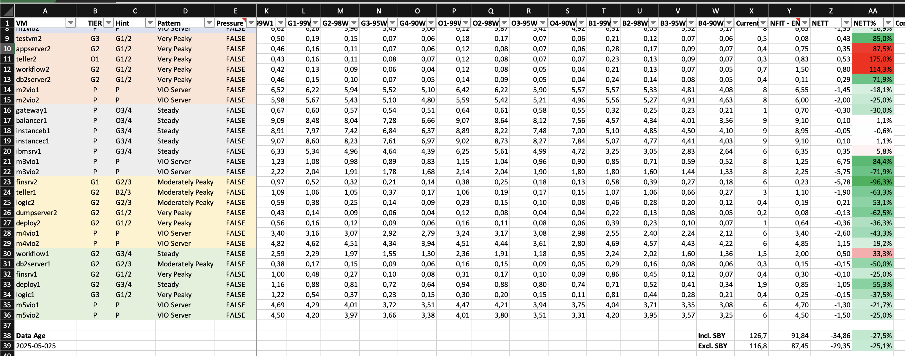

# nFit: AIX and Linux on Power VM Right-Sizing Toolkit

## Overview

nFit is designed to assist with AIX and Linux on Power LPAR (Logical Partition) CPU right-sizing on IBM Power systems. It leverages historical performance data from NMON (`PhysC` - Physical CPU consumed) to provide data-driven, statistically sound entitlement recommendations. The suite aims to move beyond subjective "eye-balling" of performance graphs, offering a consistent, automatable, and configurable approach to capacity planning.

This suite helps in optimising resource utilisation, ensuring critical workloads have the guaranteed CPU they need, while identifying potential savings by accurately sizing less critical workloads or standby systems.

This program requires NMON with InfluxDB Time-Series DB and Grafana Graphing Engine. For more information, refer to [njmon Intro and Update](https://www.ibm.com/support/pages/njmon-intro-and-update). For installation, refer to [njmon + InfluxDB + Grafana Series 10: nimon Intro & Setup](https://www.youtube.com/watch?v=9_wG9H60AGg) by Nigel Griffiths.

## 🚀 QuickStart

This guide will help you get the `nFit Suite` up and running quickly.

**1. Installation / Setup**

* **Clone the Repository:**
    ```bash
    git clone <your_github_repository_url_here> nmon-fit
    cd nmon-fit
    ```
* **Make Scripts Executable:**
    ```bash
    chmod +x nfit nfit-profile nfit-plot
    ```
* **Install Python Dependencies (for `nfit-plot`):**
    ```bash
    pip install -r requirements.txt
    ```
    *(Ensure you have Python 3 and pip installed.)*
* **(Optional) Add to PATH or Create Symlinks:** For easier execution from any directory:
    * Add the `nmon-fit` directory to your system's `PATH` environment variable.
    * Or, create symbolic links to the scripts in a directory already in your `PATH` (e.g., `~/bin/` or `/usr/local/bin/`):
        ```bash
        # Example for adding to ~/bin
        mkdir -p ~/bin
        ln -s "$(pwd)/nfit" ~/bin/nfit
        ln -s "$(pwd)/nfit-profile" ~/bin/nfit-profile
        ln -s "$(pwd)/nfit-plot" ~/bin/nfit-plot
        # Ensure ~/bin is in your PATH (add to .bashrc, .zshrc, etc.)
        # export PATH="$HOME/bin:$PATH"
        ```

**2. Initial Configuration**

The scripts use configuration files to define profiles, frame setups, and VM entitlement scenarios. Default templates are provided in the `etc/` directory and more specific examples in the `examples/` directory.

* **Create `etc/` Directory (if it doesn't exist in your working copy for user configs):**
    ```bash
    mkdir -p etc
    ```
* **Copy Default Configuration Files:** Choose a starting set of `.default` files from the `etc/` directory (if you provide them there) or the themed examples from the `examples/` directory. Copy them into your working `etc/` directory (or the script's root directory if the scripts are coded to fall back there) and remove the `.default` or `.example` suffix.
    * **For `nfit-profile` (defines calculation profiles):**
        ```bash
        cp examples/nfit.profiles.cfg.general_enterprise.example etc/nfit.profiles.cfg
        ```
    * **For `nfit-plot` (defines physical frames and plotting scenarios):**
        ```bash
        cp examples/nfit.mgsys.cfg.general_enterprise.example etc/nfit.mgsys.cfg
        cp examples/nfit.scenarios.cfg.general_enterprise.example etc/nfit.scenarios.cfg
        ```
* **Customise Configuration Files:**
    * Edit `etc/nfit.profiles.cfg` to adjust the nFit calculation profiles if needed.
    * Edit `etc/nfit.mgsys.cfg` to accurately reflect your IBM Power frame setup (number of frames, cores per frame, VIO allocations, DC Name).
    * Edit `etc/nfit.scenarios.cfg` to define the LPAR entitlement scenarios you want to visualise with `nfit-plot`.

**3. Prepare VM Configuration Data**

`nfit-profile` can merge data from a VM configuration inventory CSV file.

* **Create your VM Configuration CSV:** This file should list your VMs and their attributes.
* **Required Columns:** `hostname`, `serial`, `systemtype`, `procpool_name`, `procpool_id`, `entitledcpu`, `maxcpu`.
* **Format:** See `examples/config-all.csv.example` for the expected structure.
* **Save as:** For example, `config-all.csv` (either in the script's root or `etc/` directory, or specify the path with the `-config` option when running `nfit-profile`).

**4. Obtain Managed System Data**

- Open Grafana NJMON
- Open Whole Server by Serial Number
- Navigate to the graph Physical Consumed CPU - SERIAL
- Select Last 90 days under the time period. Wait for the load to complete (spinning circles must disappear)
- Click on the triangle shape on the title, and select Inspect data
- Click on Data options, and under Show data frame select Series joined by time
- Download the CSV file

**5. Run `nfit-profile` to Generate Sizing Data**

This script will run `nfit` multiple times based on your `etc/nfit.profiles.cfg` and produce a comprehensive CSV output.

* **Command:**
    ```bash
    ./nfit-profile --match-runq-perc-to-profile --nfit-enable-windowed-decay -f /path/to/your/nmon_data.csv -config /path/to/your/config-all.csv > nfit_sizing_report.csv
    ```
    *(Replace paths with your actual file locations. Add other options like `-s <startdate>`, `-r` or `-u` for rounding as needed.)*
* **Output:** `nfit_sizing_report.csv` (or your chosen output file) will contain the aggregated metrics for each VM.

**6. Utilise Data in Your Sizing Spreadsheet**

* **Spreadsheet Template:** Use a spreadsheet application (like Microsoft Excel, LibreOffice Calc, Google Sheets). You can base your layout on the concepts provided in `examples/nFit.xlsx`.
* **Import/Copy Data:**
    * Open `nfit_sizing_report.csv`.
    * Copy the data from this CSV.
    * Paste it into a dedicated sheet in your main sizing spreadsheet.
* **Apply Logic:** Your main sizing spreadsheet should have:
    * A column for your VMs (matching the "VM" column from `nfit-profile` output).
    * A "Type" column (e.g., "O1", "B2", "G3") which you manually populate/maintain based on business requirements for each VM.
    * The "Hint", "Pattern", "Pressure", "Serial", "SystemType", etc., columns from `nfit-profile`.
    * Columns for each metric generated by `nfit-profile` (Peak, P-99W1, G1-99W5, etc.).
    * Your "Current - ENT" column.
    * **"NFIT - ENT" (Recommended Entitlement):** This column will use a formula (e.g., `VLOOKUP` or `INDEX/MATCH` in Excel) to look up the value from the appropriate metric column (P-99W1, G1-99W5, etc.) based on the "Type" code you've assigned to the VM. It should also incorporate your PowerHA standby logic (e.g., halving the looked-up value if it's a standby node).
    * "NETT" and "NETT%" columns with formulas to calculate the difference and percentage change.

By following these steps, you can integrate the `nFit Suite` into your capacity planning workflow to generate data-driven right-sizing recommendations. Remember to consult the detailed documentation for each script (`nfit -h`, `nfit-profile -h`, `nfit-plot --help`, and the `.md` files in `doc/`) for more information on all available options and configurations.

### 📸 Example Output



## Components

The nFit Suite currently consists of three main components:

1.  **`nfit` (Perl):**
    * The core analysis engine.
    * Parses NMON `PhysC` data (exported to CSV).
    * Calculates rolling average CPU utilisation and specified percentiles of these averages.
    * Can identify absolute peak CPU consumption.
    * Offers extensive filtering options: by date range, time-of-day (including "online" and "batch" presets), specific VMs, and exclusion of weekends.
    * Includes an advanced filter (`--filter-above-perc`) to focus percentile calculations on periods of higher sustained load.
    * Provides options for rounding results to align with hardware entitlement increments.
    * Outputs results per VM to STDOUT, status/errors to STDERR.

2.  **`nfit-profile` (Perl):**
    * A wrapper script that automates multiple runs of `nfit`.
    * Reads a set of predefined "profiles" from an INI configuration file (`nfit.profiles.cfg`). Each profile defines a specific combination of `nfit` flags (percentile, window, time filters, etc.).
    * Runs `nfit` for each defined profile.
    * Always runs `nfit` with the `-k` flag to capture absolute peak usage.
    * Optionally merges static VM configuration data (e.g., serial number, system type, current entitlement, max CPU) from another CSV file (`config-all.csv` by default).
    * Generates heuristic "Hint", "Pattern", and "Pressure" columns based on the collected metrics and VM configuration to provide quick insights.
    * Aggregates all results into a single, comprehensive CSV output to STDOUT, suitable for import into spreadsheets for further analysis and decision-making.

3.  **`nfit-plot` (Python):**
    * A visualisation tool to generate capacity charts.
    * Reads frame infrastructure details from `nfit.mgsys.cfg` (number of frames, cores/VIOs per frame, DC name).
    * Reads LPAR entitlement scenarios (per-frame LPAR entitlements for different what-if scenarios) from `nfit.scenarios.cfg`.
    * For each defined scenario, it generates:
        * A DC-Wide Summary Chart: Visualising total capacity, allocations (VIO, LPARs), available headroom, and comparison against the Frame Evacuation Target for the entire Data Centre.
        * Per-Frame Detail Charts: Visualising capacity, allocation, headroom for each individual frame, and its contribution target for frame evacuation.
    * Outputs charts as PNG files to `/tmp/`.

## Core Methodology

The underlying sizing methodology (primarily implemented in `nfit` and orchestrated by `nfit-profile`) is based on:

- **Data Source:** 90 days of 1-minute interval AIX `PhysC` data from NMON.
- **Primary Metrics:**
    - **Absolute Peak:** For highest-tier systems.
    - **Percentiles of Rolling Averages:** For various tiers of sustained load, using different window sizes (W) and percentile targets (P). Common profiles include P99W5, P98W10, P95W15, P90W15.
- **Filtering:** Includes date, time-of-day (with `-online`/`-batch` presets and `-no-weekends` option), and a statistical filter (`--filter-above-perc`) to focus on relevant busy periods.
- **Tiering Concept:** The generated profiles are designed to map to different service tiers, allowing for differentiated sizing based on business criticality.
- **Heuristics (in `nfit-profile`):** Suggests workload pattern (Online/Batch/General), CPU usage shape (Peaky/Steady), and potential CPU pressure (based on P-99W1 vs. maxCPU) to aid planners.

For a more detailed explanation of the methodology, see `doc/nFit Suite - Features and Sizing Methodology Overview.md`.

There is also a Python-based animation of the basic program principles available at `examples/animate-nfit.py`.

## Prerequisites

- **For `nfit` and `nfit-profile` (Perl):**
    - Perl 5.x
    - Core Perl Modules: `Getopt::Long`, `File::Temp`, `List::Util`, `POSIX` (for `ceil`), `Time::Piece`. These are generally standard.
- **For `nfit-plot` (Python):**
    - Python 3.x
    - `matplotlib` library (`pip install matplotlib`)
    - `numpy` library (`pip install numpy`)
    (These can be installed from the `requirements.txt` file: `pip install -r requirements.txt`)

## Basic Usage

**(Ensure scripts are executable and configuration files are in place or paths specified)**

* **`nfit` (Core Analyser):**
    ```bash
    ./nfit -f <nmon_data.csv> -p 95 -w 15 -online -no-weekends
    ./nfit -f <nmon_data.csv> -k -vm myvm01 -s 2025-04-01
    ./nfit -h # For all options
    ```

* **`nfit-profile` (Profile Runner & CSV Generator):**
    ```bash
    # Recommended usage:
    ./nfit-profile --match-runq-perc-to-profile --nfit-enable-windowed-decay -config vm_config.csv -pc physc.csv -rq runq.csv > /tmp/nfit-mgsysname.csv 
    # Using default config file locations (./etc/ or ./):
    ./nfit-profile -f <nmon_data.csv> > full_report.csv
    ./nfit-profile -f <nmon_data.csv> -config my_vm_inventory.csv -u > rounded_report.csv
    ./nfit-profile -h # For all options
    ```

* **`nfit-plot` (Visualisation Tool):**
    ```bash
    # Using default config file locations (./etc/ or ./):
    ./nfit-plot
    ./nfit-plot --mgsys-config custom_frames.cfg --scenarios-config custom_scenarios.cfg
    ./nfit-plot -h # For all options
    ```
    *(Charts are saved to ./output/)*

## Output

* **`nfit`:** Prints results to STDOUT in the format `VMName: PXX=Value Peak=Value`. Status messages to STDERR.
* **`nfit-profile`:** Prints a comprehensive CSV table to STDOUT. Status messages to STDERR. Key columns include VM, Hint, Type (user-defined), Pattern, Pressure, config data, Peak, all profile results, Current Entitlement, and blank columns for spreadsheet formulas.
* **`nfit-plot`:** Saves PNG chart images to `./output/`, showing DC-wide and per-frame capacity scenarios. Prints status messages to STDOUT.

## Contributing

Contributions are welcome and encouraged! Whether it’s reporting a bug, suggesting an enhancement, improving documentation, or submitting code — your help makes the project better.

Ways to contribute:
	•	💡 Open a Discussion to ask questions or propose ideas.
	•	🐞 File an Issue for bugs, feature requests, or enhancements.
	•	🔧 Fork the repository and submit a Pull Request (PR) for improvements.
	•	📚 Help improve documentation or usage examples.

Guidelines:
	•	Please ensure your changes are clear, concise, and tested where applicable.
	•	Follow the existing code style and structure.
	•	For significant changes, open a discussion first to avoid duplicated work.

Optional:

If your contribution relates to commercial or enterprise use cases, please feel free to start a Discussion labelled enquiry.

## 👤 Author

Developed and maintained by Niël Lambrechts.

## Support

nFit is offered as a free and open-source tool, licensed under the GNU AGPL v3.0. If you find it useful and would like to support its ongoing development, maintenance, and the addition of new features, please consider making a small donation.

Your support helps to dedicate more time to improving nFit and is greatly appreciated!

* **PayPal:** `https://paypal.me/NielLambrechts`
* **Bitcoin (BTC):** `3MuQ5SRyVG8UjQzeuSjpqhNGPm92dcU26t`

Thank you for your support!

## ⚙️  Value-Added Commercial Services

In some cases, it may be possible to arrange access to enhanced features such as:
- Automated generation of managed system and virtual machine (LPAR) configuration data
- Extensive system health check scripts tailored to AIX and Linux on Power environments

Provision of such services is subject to commercial terms and may involve prior consultation with existing service providers or partners. These options are considered on a case-by-case basis and may not be immediately available.

For commercial or collaboration enquiries, please open a [GitHub Discussion](https://github.com/niel-lambrechts/nfit/discussions) with the `enquiry` label.

## License

This project is licensed under the [GNU AFFERO GENERAL PUBLIC LICENSE (AGPL-3.0)](LICENSE) - see the LICENSE file for details.

## Contributors

Special thanks to Dewalt Claassen (Senior Capacity Planner at [MentPro Computer Services](https://mentpro.co.za)) for his invaluable insights and recommendations on the statistical methodology and tiering strategy, which helped to shape the nFit sizing approach.

## 🔖 Keywords
AIX · NMON · Capacity Planning · Right-Sizing · IBM Power · Linux on Power · Performance Tuning · Shell Scripting
